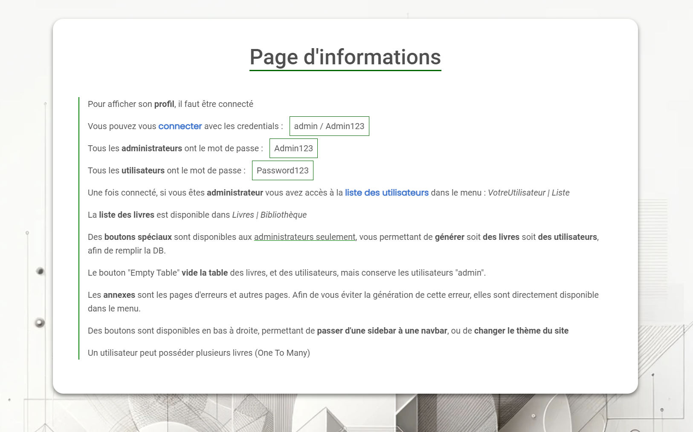

. . . . . . . . . . . . . . . . .
.                               .
.      🛠️ Installation 🛠️     .
.                               .
. . . . . . . . . . . . . . . . .

<strong>create venv :</strong> 
python3 -m venv venv

<strong>activate venv : </strong> 

win :  
.\venv\Scripts\activate

linux: 
source venv/bin/activate 

<strong>Install requirements:</strong> 
pip3 install -r .\requirements.txt  

<strong>Run the app :</strong> 
uvicorn app.main:app --reload

. . . . . . . . . . . . . . . . . 
.                               .
.         ℹ️ Informations ℹ️          .
.                               .
. . . . . . . . . . . . . . . . .

find all <strong>infos on localhost/infos</strong>

  

